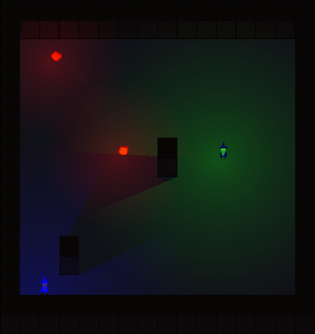

# arpg


An action RPG focused on magic. It is currently under progress and far from complete.

## Building
For now, the game is only possible to compile on Linux. Windows builds are planned in the future.

If compiling with the preprocessor define `DEBUG_BUILD=1`, hot reloading will be enabled for
both assets and game code.
This means that if recompiling, the game code will be reloaded and any changes made to source
files in the `src/game` directory will be visible immediately without restarting the application.
The same is true for assets: when an asset such as a shader or sprite is modified, the asset
will change immediately in game.

### Dependencies
- `glfw3`
- `GLEW`
- `X11`

### Compiling
```bash
mkdir build && cd build
cmake ..
cd ..
cmake --build build -j
```

### Running
```bash
./build/arpg
```

## Controls
Please be aware that the gameplay is still in a prototyping stage and any controls are subject to change.

- Aim with mouse
- Cast the currently selected spell with left click
- Press `i` to open the menu containing inventory, spellbook and equipment
- Hover over items in inventory to see their stat modifiers
- Click any item in inventory to equip it
- Click any equipped item to unequip it
- Click any spell in spellbook the make it the selected spell

### Debug controls
- Press `t` to open the debug overlay
